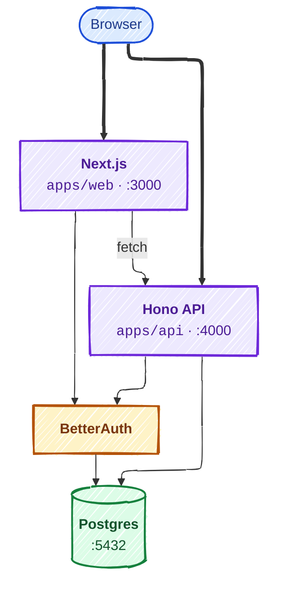

# FullStackSkeleton

[](https://github.com/semantic-release/semantic-release)

A full-stack application skeleton built as a pnpm monorepo with Turborepo.

## Architecture



- **apps/web** -- Next.js frontend. No business-logic API routes. Fetches data from the Hono API via a generated typed client. Auth handled by BetterAuth with GitHub OAuth.
- **apps/api** -- Hono API server. All backend logic organized as vertical slices (`features/dashboard/`, `features/billing/`). OpenAPI spec auto-generated from route definitions. Protected by session-based auth middleware.
- **apps/ios** -- SwiftUI project scaffold with OpenAPI Generator config for typed Swift client codegen.
- **packages/shared** -- Zod schemas (single source of truth for types), constants. Used by both web and API.
- **packages/auth** -- BetterAuth configuration shared by web and API. Framework-specific wrappers for Next.js (`/next`) and client-side (`/client`).
- **packages/db** -- Prisma schema and client singleton. Only place Prisma is instantiated.
- **packages/api-client** -- Generated TypeScript fetch client from the OpenAPI spec. Used by the web app for fully typed API calls.
- **packages/api-spec** -- Script to generate `openapi.yaml` from the Hono app's route definitions.

## Getting Started

### Dev Container

Requires [VS Code](https://code.visualstudio.com/) with the [Dev Containers extension](https://marketplace.visualstudio.com/items?itemName=ms-vscode-remote.remote-containers) (or any DevContainer-compatible editor) and Docker.

1. [Create a GitHub OAuth app](https://github.com/settings/developers) with callback URL `http://localhost:3000/api/auth/callback/github`
2. Open VS Code and run **Dev Containers: Clone Repository in Container Volume** from the command palette
3. Paste the repo URL and let the container build
4. The container generates `.env.local` with sensible defaults. Fill in your GitHub OAuth credentials:

```bash
GITHUB_CLIENT_ID=<your-client-id>
GITHUB_CLIENT_SECRET=<your-client-secret>
```

5. Run `pnpm dev` and you're up

### What `pnpm dev` starts

Open http://localhost:3000 to access the app. The other services are available from the admin sidebar after signing in:

- **API Docs** at http://localhost:4000/docs
- **DB Studio** at http://localhost:5555
- **Sentry Spotlight** at http://localhost:8969

### Promote yourself to admin

After your first sign-in, promote your user to admin:

```bash
docker exec $(docker ps -q --filter ancestor=postgres:17-alpine) \
  psql -U skeleton -d skeleton -c \
  "UPDATE \"user\" SET role = 'admin' WHERE email = '<your-email>';"
```

### Admin tools (available in the sidebar when signed in)

- **API Docs** (`/api-docs`) -- Swagger UI for the Hono API
- **DB Studio** (`/db-studio`) -- Prisma Studio for database inspection
- **Spotlight** (`/spotlight`) -- Sentry Spotlight for local error and trace inspection
- **Impersonate** (`/impersonate`) -- View the app as another user. Select any user from the list or create a test user on the fly. Your admin session is preserved (tracked via the `impersonatedBy` field on the session), and an amber banner appears in the header with a "Stop Impersonating" button to end the session. Nested impersonation is not allowed.

## Scripts

| Command                              | Description                                                        |
| ------------------------------------ | ------------------------------------------------------------------ |
| `pnpm dev`                           | Start all services (web + API + Prisma Studio + Sentry Spotlight)  |
| `pnpm build`                         | Build all packages and apps                                        |
| `pnpm lint`                          | Lint all packages                                                  |
| `pnpm test`                          | Run tests with coverage                                            |
| `pnpm clean`                         | Remove node_modules, .turbo, .next, and .pnpm-store                |
| `pnpm --filter @skeleton/db db:push` | Push Prisma schema to database                                     |
| `pnpm --filter @skeleton/db studio`  | Open Prisma Studio standalone                                      |
| `pnpm codegen:openapi`               | Generate OpenAPI spec from Hono routes                             |
| `pnpm codegen:swift`                 | Generate Swift types from OpenAPI spec                             |
